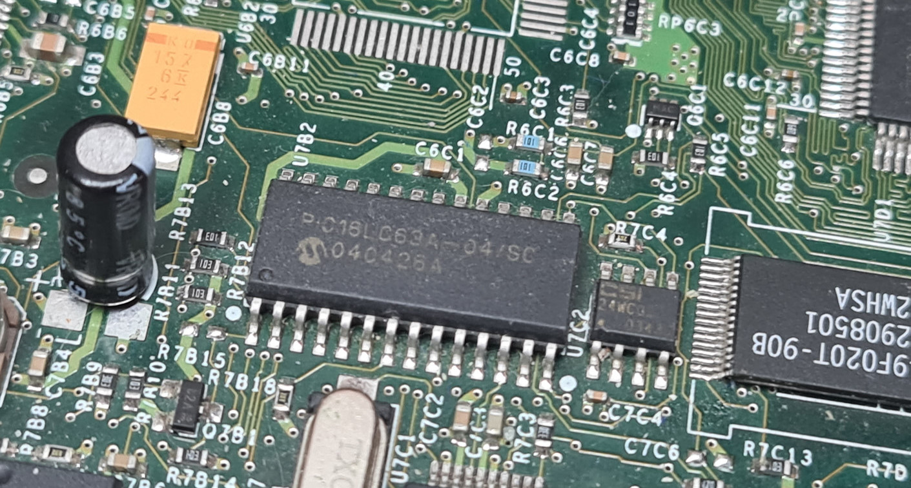

# Xbox_SMC
PIC16/Xyclops dumps from the original Xbox and IDA databases with some reverse engineering done.

# Dumps
The .bin file for each dump has the bytes swapped for correct loading into IDA. So the first word of PIC memory is byte_0 + byte_1 << 8.

The .idb IDA databases have info about variable and some observations on the database notepad.

See this wiki page for a breakdown of the SMC versions: https://xboxdevwiki.net/Xboxen_Info

## P01
Dumped from a v1.0 Xbox. The config word is 0x86:
- CP1:CP0 = 0 (Code Protection enabled for the whole memory)
- BODEN = 0 (Brown-out Reset disabled)
- ~PWRTE = 0 (Power-up Timer enabled)
- WDTE = 1 (Watchdog Timer enabled)
- FOSC1:FOSC0 = 2 (HS oscillator)

A config value of 0x3FB6 is suitable for SMC clones so that they don't have code protection enabled.

## P11
Dumped from a v1.3 Xbox. Same config word as P01.

There are a few small changes in P11 versus P01 including an extra SMBus command (write 0x22), different LED priorities, and more relaxed timings for boot.

I checked scrambled dumps of v1.3 against v1.4 and they matched. This means it's highly likely they have the same program.

## P2L
Dumped from a v1.6 Xbox. Xyclops revision A-A02.

The machine code matches Intel 8051 quite well but not perfectly.

# Xyclops dumping

The Xyclops chip has 3 pins for 'debug': TXD (pin 64), RXD (pin 63), and DEBUG (pin 29). Set the DEBUG pin high to enable the serial port on the TX and RX pins. The serial operates at 9600 baud.

The protocol is based on 4-byte commands which are typically in the format `<cmd>` `<address MSByte>` `<address LSByte>` `<don't care>`

Command 0x14 dumps out 64 bytes of BIOS data at a time and 0x15 dumps 64 bytes of SMC program data at a time. A dump from Xyclops, P2L.bin, is included in the repo. xyclops_dumper.py is also included for you to dump your own machine.

# PIC dumping methodology
I don't want to reveal all the details yet, so here is the vague outline on how I dumped the PIC.

The PIC has its code protection enabled so all the data reads as 0000. I used some trick to get scrambled data output instead, discovered the scrambling algorithm using a sacrificial chip, and then used a kind of exploit to change the ROM data to fix some bits to known values. Then I can extract the required information from the multiple scrambled dumps to rebuild the original data.

# PICProgrammer
PICProgrammer is one of a few Arduino projects for the RP2040 that I used in my research. It provides a simple command-line interface to execute ICSP (in-circuit serial programming) operations on the PIC. This is favoured over using a purpose-build programmer such as the PICkit due to its flexibility and the option of doing things that the manufacturer didn't intend.

You should have a good understanding of electronics and programming before using this, and take a good look over what commands do before executing them.
